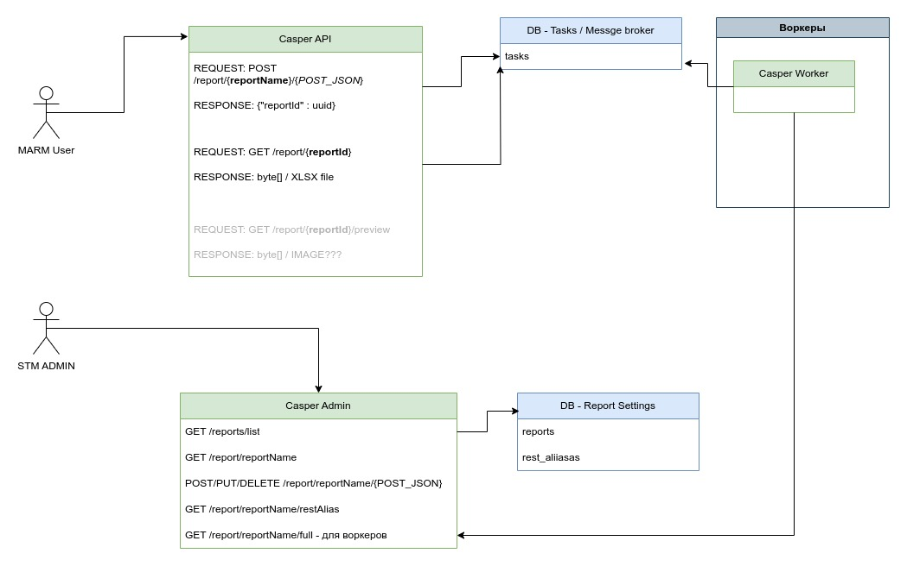

## Casper - Proof of Concept

{@@FD\_RESTNAME\_PARAMNAME@@}

FD - FilterData - данные из фильтра

RESTNAME - может быть несколько запросов для одного ответа, для каждого прописанного в админке должно быть уникальное имя  
PARAMNAME - имя параметра откуда читаем данные, корнем объекта являться начало отрывания JSON

Получаем данные в формате JSON, под каждый рест запрос создаем два списка :

1.  для входных параматеров
2.  для возвращаемых параматеров

Объекты должны быть нодами JSON, проходим их рекурсивно и заполняем списки по следующему правилу: {@@FD/RD\_RestNameAlias\_paramName.paramFieldName.paramFiledName\[0..1...n, first, last\].paramFieldName@@}

<table><tbody><tr><td>Имя части переменной</td><td>Описание и предназначение</td></tr><tr><td>FD</td><td>Данные из входного запроса</td></tr><tr><td>RD</td><td>Данные возвращаемые рестом</td></tr><tr><td>RDI_START_</td><td>
итеррируемые данные для рестов, октрытие иттеарции, строка с этим параметром удаляется из отчета

&nbsp;
</td></tr><tr><td>RDI_END_</td><td>
итеррируемые данные для рестов, закрытие итерации, строка с этим параметром удаляется из отчета

&nbsp;
</td></tr><tr><td>&nbsp;</td><td>&nbsp;</td></tr><tr><td>RestNameAlias</td><td>имя алиаса для реста, куда/откуда идут данные</td></tr><tr><td>paramName</td><td>имя параметра переданного в джэйсон начиная от корня</td></tr><tr><td>paramFieldName</td><td>имя параметра, для не корневого элемента, поле объекта</td></tr><tr><td>paramFiledName[]</td><td>
имя параметра, для не корневого элемента, поле объекта, который содержит в себе массив

допустимые значения&nbsp;

0..n - обращение к элементу по индексу&nbsp;

first- аналогично 0, можно не реализовывать

last - последний элемент в списке

&nbsp;
</td></tr><tr><td>&nbsp;</td><td>&nbsp;</td></tr><tr><td>IE</td><td>IterableElement - используется в структуре иттерируемых данных, указываем имя параметра в шаблоне считая RDI корнем&nbsp;</td></tr><tr><td>&nbsp;</td><td>&nbsp;</td></tr></tbody></table>

---

\_ разделитель между сущностями

{@@ и @@} обертки указывающие, что это перемеренная шаблона (можно будет подумать как заменить, чтобы не было лишней нагрузки)

---

Идея, создаем Мапу в которой ключи это {@@FD/RD\_RestNameAlias\_paramName.paramFieldName.paramFiledName\[0..1...n, first, last\].paramFieldName@@}, а значения собственно полученные значения , тип HashMap\<String, String> (через рекурсии)

После того как проходим строчки и ищем переменные шаблоны, если находим берем из мапы, если это не иттериуремые дынне (под них может имеет смысл завести отдельную мапу, для скорости?)

Если находим маркеры иттераций, то начиная со следующей строки берем ее, и строим для нее таблицу, по тому количеству элементов сколько для нее есть (имеет смысл ладе сначала подготовить шаблон , чтобы все значения были проставлены ,а потом применять механизм реплейсса для уже подготовленных строк??).  
и вообще при создании мапы с параметерами, еще дополнительно вести учет для иттерируемых структур

---

![](## Casper - Proof of Concept

{@@FD\_RESTNAME\_PARAMNAME@@}

FD - FilterData - данные из фильтра

RESTNAME - может быть несколько запросов для одного ответа, для каждого прописанного в админке должно быть уникальное имя  
PARAMNAME - имя параметра откуда читаем данные, корнем объекта являться начало отрывания JSON

Получаем данные в формате JSON, под каждый рест запрос создаем два списка :

1.  для входных параматеров
2.  для возвращаемых параматеров

Объекты должны быть нодами JSON, проходим их рекурсивно и заполняем списки по следующему правилу: {@@FD/RD\_RestNameAlias\_paramName.paramFieldName.paramFiledName\[0..1...n, first, last\].paramFieldName@@}

<table><tbody><tr><td>Имя части переменной</td><td>Описание и предназначение</td></tr><tr><td>FD</td><td>Данные из входного запроса</td></tr><tr><td>RD</td><td>Данные возвращаемые рестом</td></tr><tr><td>RDI_START_</td><td>
итеррируемые данные для рестов, октрытие иттеарции, строка с этим параметром удаляется из отчета

&nbsp;
</td></tr><tr><td>RDI_END_</td><td>
итеррируемые данные для рестов, закрытие итерации, строка с этим параметром удаляется из отчета

&nbsp;
</td></tr><tr><td>&nbsp;</td><td>&nbsp;</td></tr><tr><td>RestNameAlias</td><td>имя алиаса для реста, куда/откуда идут данные</td></tr><tr><td>paramName</td><td>имя параметра переданного в джэйсон начиная от корня</td></tr><tr><td>paramFieldName</td><td>имя параметра, для не корневого элемента, поле объекта</td></tr><tr><td>paramFiledName[]</td><td>
имя параметра, для не корневого элемента, поле объекта, который содержит в себе массив

допустимые значения&nbsp;

0..n - обращение к элементу по индексу&nbsp;

first- аналогично 0, можно не реализовывать

last - последний элемент в списке

&nbsp;
</td></tr><tr><td>&nbsp;</td><td>&nbsp;</td></tr><tr><td>IE</td><td>IterableElement - используется в структуре иттерируемых данных, указываем имя параметра в шаблоне считая RDI корнем&nbsp;</td></tr><tr><td>&nbsp;</td><td>&nbsp;</td></tr></tbody></table>

---

\_ разделитель между сущностями

{@@ и @@} обертки указывающие, что это перемеренная шаблона (можно будет подумать как заменить, чтобы не было лишней нагрузки)

---

Идея, создаем Мапу в которой ключи это {@@FD/RD\_RestNameAlias\_paramName.paramFieldName.paramFiledName\[0..1...n, first, last\].paramFieldName@@}, а значения собственно полученные значения , тип HashMap\<String, String> (через рекурсии)

После того как проходим строчки и ищем переменные шаблоны, если находим берем из мапы, если это не иттериуремые дынне (под них может имеет смысл завести отдельную мапу, для скорости?)

Если находим маркеры иттераций, то начиная со следующей строки берем ее, и строим для нее таблицу, по тому количеству элементов сколько для нее есть (имеет смысл ладе сначала подготовить шаблон , чтобы все значения были проставлены ,а потом применять механизм реплейсса для уже подготовленных строк??).  
и вообще при создании мапы с параметерами, еще дополнительно вести учет для иттерируемых структур

---

Параметры для CASPER API:

POST\_JSON:

{

“restNameAlias1” : {},

“restNameAlias2” : {},

“restNameAlias3” : {},

}

в restNameAlias мы кладем объекты, которые будут передаваться в соотвесвующие ресты прописананые в админке по управлению репортом.

Задания с фронта будут отправляться в БД/Брокер сообщений, которую будут слушать воркеры, и при появлении новой задачи, воркер будет брать ее себе и зная выданный CASPER API айди  задачи проводить построение отчета и менять статус в работе/ошибка/выполнено,   
фронт в свою очередь будет по репорт айди полить CASPER API.

Воркеры для того чтобы понимать как им построить отчет будут обращаться в админку и спрашивать там настройки отчета (имя они знают, параметры придут из CASPER API)
Параметры для CASPER API:

POST\_JSON:

{

“restNameAlias1” : {},

“restNameAlias2” : {},

“restNameAlias3” : {},

}

в restNameAlias мы кладем объекты, которые будут передаваться в соотвесвующие ресты прописананые в админке по управлению репортом.

Задания с фронта будут отправляться в БД/Брокер сообщений, которую будут слушать воркеры, и при появлении новой задачи, воркер будет брать ее себе и зная выданный CASPER API айди  задачи проводить построение отчета и менять статус в работе/ошибка/выполнено,   
фронт в свою очередь будет по репорт айди полить CASPER API.

Воркеры для того чтобы понимать как им построить отчет будут обращаться в админку и спрашивать там настройки отчета (имя они знают, параметры придут из CASPER API)
